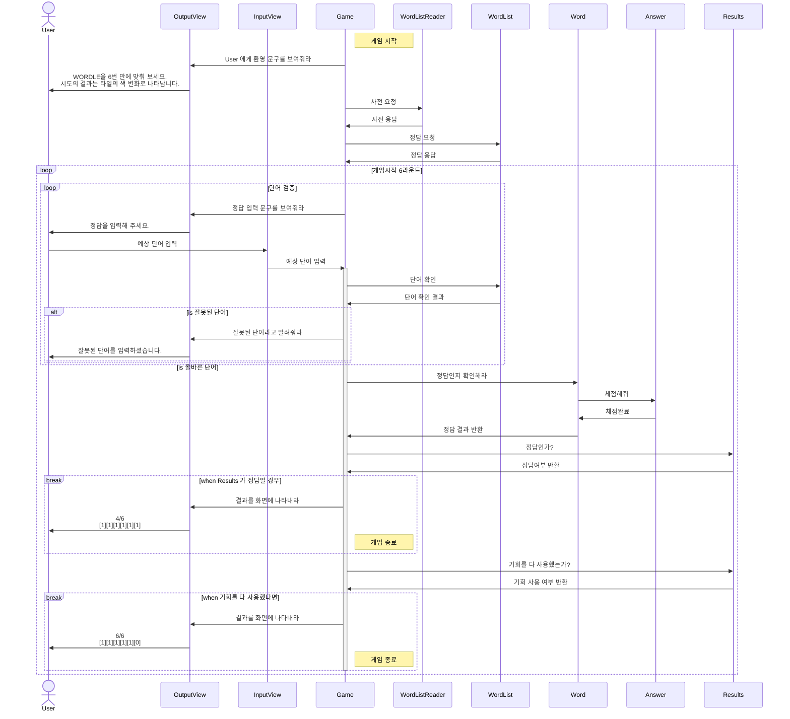
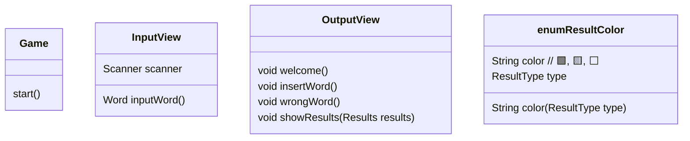
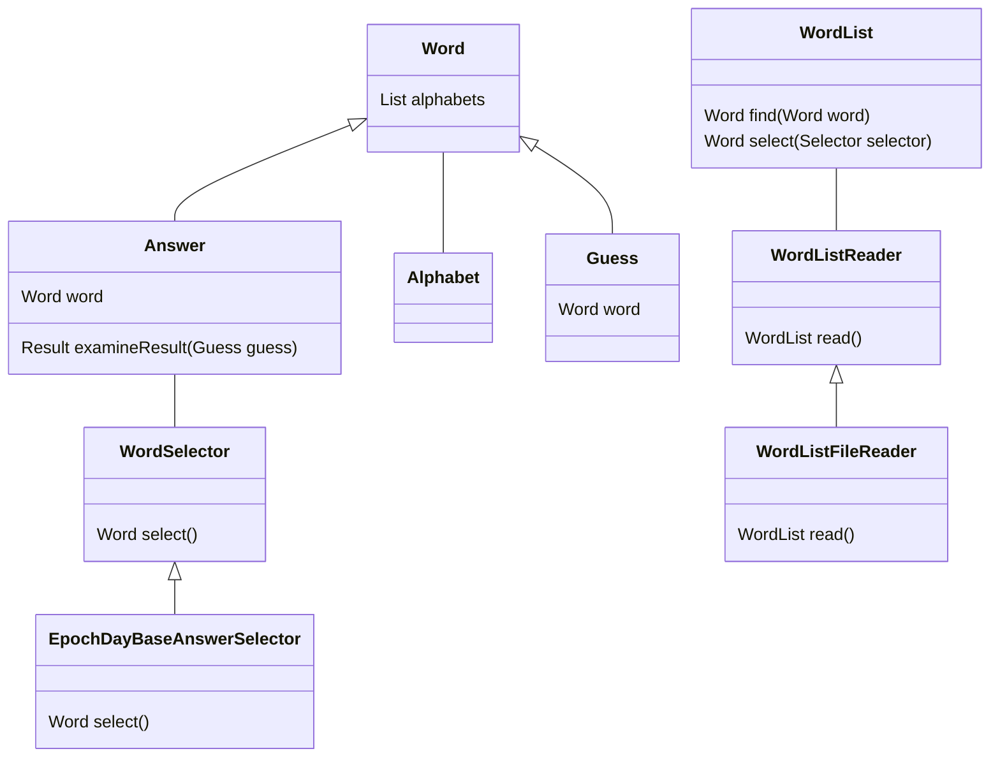
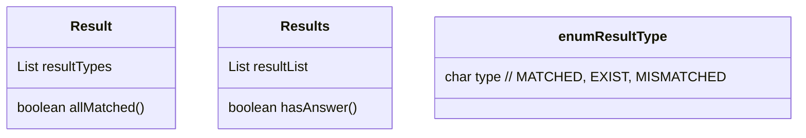

# 미션 - 워들
- 참여자 : 우지, 구월

## 시퀀스 다이어그램

---

## 클래스 설계

### view

### Word

### Result

---

## 테스트케이스

- Game
    - [x]  게임은 지정된 횟수만큼 입력받고 종료된다.
- Word
    - [x]  단어에 알파벳 소문자가 아닌 문자가 들어오면 예외를 반환한다.
    - [x]  단어는 5글자이다.
    - [x]  단어가 5글자가 아니면 예외를 반환한다.
- Answer
    - [x]  정답은 답안을 기반으로 결과를 반환할 수 있다.
- AnswerSelector
    - [x]  정답은 매일 바뀌며 `((현재 날짜 - 2021년 6월 19일) % 배열의 크기)` 번째의 단어이다.
- WordList
    - [x]  주어진 단어가 WordList 안에 있으면 true를 반환한다.
    - [x]  주어진 단어가 WordList 안에 없으면 false를 반환한다.
    - [x]  주어진 Selector의 조건에 해당하는 단어를 추출한다.
- Result
    - [x]  판별 결과는 세 가지 색(초록색/노란색/회색) 중 하나로 표현되어야 한다.
- Results
    - [x]  정답을 포함하고 있는 경우 true를 반환한다.
    - [x]  정답을 포함하고 있지 않은 경우 false를 반환한다.
