# 미션 - 워들

## 게임 진행 순서

- 단어장(`words.txt`)에 있는 단어를 읽어들인다.
- 읽어들인 단어들에서 정답인 단어를 정한다.
    - 정답은 매일 바뀌며 ((현재 날짜 - 2021년 6월 19일) % 배열의 크기) 번째의 단어이다.
- 문자 5개를 입력한다.
    - 5개가 아닌 경우 재입력을 받는다.
    - 단어장에 존재하지 않는 단어인 경우 재입력을 받는다.
    - 알파벳이 아닌 경우 재입력을 받는다.
- 입력받은 문자와 정답을 비교한다.
- 비교 결과는 타일이 초록색/노란색/회색 중 하나로 바뀌면서 표현된다.
    - 맞는 글자는 초록색, 위치가 틀리면 노란색, 없으면 회색
    - 같은 문자가 n개 입력되었을 때, 해당 문자가 정답에 하나만 존재하지만 위치가 틀린 경우 첫번 째 문자만 노란색으로 표시된다.
        - 정답: lurid, 입력: hello, 결과: ⬜⬜🟨⬜⬜
- 6번 안에 맞추면 게임을 종료한다.
- 6번 안에 맞추지 못하면 그래도 종료한다.

## 용어 사전

| 한글명    | 영문명            | 설명                                             |
|--------|----------------|------------------------------------------------|
| 워들     | Wordle         | 5글자 영어 단어 맞추기 게임                               |
| 단어장    | Word Book      | 이 게임에서 사용될 수 있는 단어 모음                          |
| 입력 단어  | Input Word     | 플레이어가 입력하는 5글자 단어                              |
| 정답 단어  | Answer Word    | 오늘 게임의 정답인 5글자 단어                              |
| 글자     | Letter         | 단어를 구성하는 알파벳                                   |
| 영문     | Alphabet       | 글자를 구성하는 최소단위                                  |
| 위치     | Position       | 단어를 구성하는 글자의 위치                                |
| 플레이어   | Player         | 게임에 참여하는 사용자                                   |
| 결과     | Result         | 입력단어와 정답단어를 비교해서 표현되는 타일모음                     |
| 비교     | Compare        | 입력단어와 정답단어의 글자와 위치를 비교하는 행위                    |
| 초록색 타일 | Green Tile     | 글자와 위치가 동일한 경우 표현되는 타일                         |
| 노란색 타일 | Yellow Tile    | 글자는 포함되지만 위치가 다른 경우 표현되는 타일                    |
| 회색 타일  | Gray Tile      | 글자와 위치가 모두 다른 경우 표현되는 타일                       |
| 결과모음   | Results        | 라운드가 진행될 때 마다 누적된 결과모음                         |
| 기록모음   | Record         | 누적된 결과모음의 기록                                   |
| 기준일    | Base Date      | 오늘의 정답 단어를 계산하는 기준일(2021년 6월 19일)              |
| 정답 공식  | Answer Formula | 오늘의 정답 단어를 계산하는 공식 `(현재 날짜 - 기준일) % 단어장의 단어 수` |
| 시작     | Start          | 플레이어가 워들을 시작하는 행위                              |
| 종료     | End            | 워들이 종료되는 행위(라운드가 전부 끝났거나, 그 전에 정답을 맞추면 종료된다)   |

## 모델링

### 클래스 다이어그램

```mermaid
---
title: Wordle
---
classDiagram
    class Word {
        -List<Letter> letters
        +compare(Word inputWord) Results
        +equals(Object o) boolean
    }

    class WordComparator {
        -List<Letter> pendingLetters
        -Results results
        +WordComparator(letters: List<Letter>)
        +compare(inputWord: Word): Results
        -process(targetLetter: Letter, predicate: Predicate<Letter>, tile: Tile)
        -fillEmptyToGray(targetLetter: Letter)
    }

    Word --|> WordComparator

    class Letter {
        -Alphabet alphabet
        -Position position
        +isSameAlphabet(Letter letter) boolean
        +getPosition() Position
        +equals(Object o) boolean
    }

    class Alphabet {
        -char alphabet
        +equals(Object o) boolean
    }

    class Position {
        -char position
        +compareTo(Position position) boolean
        +equals(Object o) boolean
    }
    
    class Record {
        -List<Results> record
        +add(Results results) void
        +isEnd() boolean
        +isCountOver() boolean
        +existAllGreen() boolean
        +iterator() Iterator<Results>
        +size() int
    }
    class Results {
        -SortedSet<Result> results
        +add(Result result) void
        +isCheckedPosition(Position position) boolean
        +isAllGreen() boolean
    }
    class Result {
        -Tile tile
        -Position poistion
        +isSamePosition(Position position) boolean
        +equals(Object o) boolean
        +compareTo(Result result) int
        +isGreen() boolean
        +isYellow() boolean
        +isGray() boolean
    }
    class Tile {
        <<enumeration>>
        +GREEN
        +YELLOW
        +GRAY
    }
    class AnswerFormula {
        <<interface>>
        +calculate(int wordCount) int
    }
    class BaseAnswerFormula {
        +calculate(int wordCount) int
    }
    BaseAnswerFormula ..|> AnswerFormula
    class Wordle {
        -WordBook wordBook
        -InputView inputView
        -OutputView outputView
        -Record record
        -AnswerFormula answerFormula
        +startGame() void
        -runGame(Word answerWord) void
        -processTurn(Word answerWord) void
        -concludeGame() void
        -handleWrongAnswer(Runnable runnable) void
    }
    class WordBook {
        <<interface>>
        +pick(AnswerFormula formula) Word
        +exist(Word word) boolean
        +find(String target) Word
    }
    class FileWordBook {
        -List<Word> words
        +pick(AnswerFormula formula) Word
        +exist(Word word) boolean
        +find(String target) Word
    }
    FileWordBook ..|> WordBook
```

## 🚀 세부 요구 사항

- 6x5 격자를 통해서 5글자 단어를 6번 만에 추측한다.
- 플레이어가 답안을 제출하면 프로그램이 정답과 제출된 단어의 각 알파벳 종류와 위치를 비교해 판별한다.
- 판별 결과는 흰색의 타일이 세 가지 색(초록색/노란색/회색) 중 하나로 바뀌면서 표현된다.
    - 맞는 글자는 초록색, 위치가 틀리면 노란색, 없으면 회색
    - 두 개의 동일한 문자를 입력하고 그중 하나가 회색으로 표시되면 해당 문자 중 하나만 최종 단어에 나타난다.
- 정답과 답안은 `words.txt`에 존재하는 단어여야 한다.
- 정답은 매일 바뀌며 ((현재 날짜 - 2021년 6월 19일) % 배열의 크기) 번째의 단어이다.
